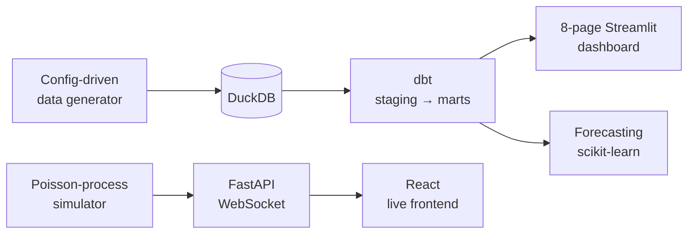

# Ha Duong (Jack) Nguyen

**Data Engineer** — Python, SQL, dbt, DuckDB | Analytics Engineering, Pipeline Testing & CI/CD

Melbourne, Australia · [LinkedIn](https://www.linkedin.com/in/nguyen-ha-duong) · nguyenduongha2000@gmail.com

I build data pipelines that are tested, documented, and reproducible. My focus is analytics
engineering — dimensional modelling, transformation layers with real data-quality coverage, and
the software practices that keep a pipeline correct as it changes.

MSc Data Science (Swinburne), with prior analytics and automation work in financial services.

---

## Restaurant Operations Intelligence Platform

**[github.com/sagameko/Restaurant-Management](https://github.com/sagameko/Restaurant-Management)**

An end-to-end operations platform for a synthetic restaurant, simulated day by day across a full
year — where demand, staffing, inventory, and customer experience interact the way they do in a
real kitchen.

| | |
|---|---|
| **Warehouse** | dbt on DuckDB — staging → intermediate → dimensions/facts → 7 marts, 98 data-quality tests |
| **Dashboard** | 8 pages reading exclusively from marts: Executive Overview, Menu Engineering, Channel Profitability, Service Performance, Labour Productivity, Inventory Risk, Customer Experience, Demand Forecast |
| **Forecasting** | Naive and moving-average baselines benchmarked against linear regression and random forest, time-based validated — 7-day forecast plus staffing recommendation |
| **Real-time** | FastAPI + WebSocket order stream, consumed by a 4-page React/TypeScript frontend |
| **Quality** | 96 Python + 12 frontend tests, including end-to-end pipeline and headless-browser checks |
| **CI** | Two parallel GitHub Actions jobs per PR — lint → test → generate → load → dbt build → verify marts |

Nine maintained docs cover architecture, business rules, algorithms, the data dictionary, and
known limitations — including a development log of bugs found while building, in
Problem / Cause / Resolution / Lesson format.

---

## Also Built

**[Movie Recommendation System](https://github.com/sagameko/Movie-Recommender)** — content-based
recommender using TF-IDF and cosine similarity over genres and user tags. Modular ETL → DuckDB →
feature mart → recommender, with a Streamlit interface.

**[Retail Analytics Warehouse](https://github.com/sagameko/retail-analytics-warehouse)** — dbt on
DuckDB with four dimensions, a sales fact table, and analytics marts, tested for null, uniqueness,
and dimension-key integrity.

---

## Experience

**Peloton Partners** — Data Analytics & Automation

Automated financial reporting pipelines in Python and R; P&L normalisation and categorisation;
structured extraction from PDF, Excel, and Word documents; benchmarking dashboards. Reduced
manual reporting effort and improved delivery turnaround.

---

## Education

**MSc Data Science** — Swinburne University of Technology
**BSc Computer Science** — Assumption University

---

## Skills

**Shipped in projects** — Python · SQL · dbt · DuckDB · pandas · NumPy · scikit-learn ·
Streamlit · Plotly · pytest · Ruff · Git · GitHub Actions · Pydantic

**Working knowledge** — FastAPI · React · TypeScript · Tailwind · R · SQLite · PostgreSQL ·
Power BI · Tableau

**Building toward** — Airflow / Dagster · Docker · Snowflake · BigQuery · AWS
